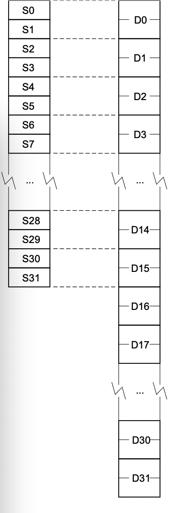

# Section 2 / Registers (Simplified)

## Overview

There are four highest level ideas relating to floating point operations
on AARCH64.

* There is another complete register set for floating point values.

* There are alternative instructions just for floating point values.

* There are exotic instructions that operate on sets of floating point
  values (SIMD).

* There are instructions to go back and forth to and from the integer
  registers.

## Floating Point Registers

There will be a more detailed discussion of the floating point registers
when exotic instructions such as SIMD are discussed. For now, it is
sufficient to discuss the less exotic aliases of the floating point
registers.

We say aliases because, like the integer registers, how you reference a
floating point register determines how it is interpreted.

For example, in the following image, note the overlap of two single
precision floats within a single double precision floating point
register.

It is worth noting early and often that you should not mix dealing
with different precisions assuming that because of the overlaps in
space, you'll get a meaningful result.

The above image does not show the corresponding layout of [half
precision](./half.md) floating point registers. `H0` sits in the least
 significant bits of `S0` and so on.
